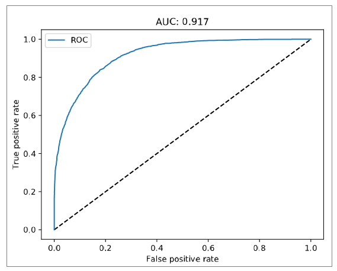

# Data Science Project Report: Machine Learning Sample for UCI Adult Income Classification Dataset Using Team Data Science Project (TDSP) Template

[comment]: # (This document is intended to capture the use case summary for this engagement. An executive summary should contain a brief overview of the project, but not every detail. Only the current summary should be captured here and this should be edited over time to reflect the latest details.)
[comment]: # (Some ideas of what to include in the executive summary are detailed below. Please edit and capture the relevant information within each section)
[comment]: # (To capture more detail in the scoping phase, the optional template Scoping.md may be utilized. If more detail around the data, use case, architecture, or other aspects needs to be captured, additional markdown files can be referenced and placed into the Docs folder)

This file contains information about the project being executed (in this case, the UCI Adult Income sample using Machine Learning)

## 1. Business Understanding
* NOTE: This is a sample for a tutorial, so scope, plan etc., does not necessarily correspond to an actual data science project addressing a specific business question. In an actual project, the problem definition, scope, plan, personnel sections are likely to be much more detailed, based on discussions with the client (or business owner), the structure of the data science team etc.

### Problem Definition
The purpose of this sample is to show how to instantiate and execute a projet using the TDSP structure and templates.

The dataset for this project is from the UCI ML Repository [[link]](https://archive.ics.uci.edu/ml/datasets/adult). It is taken from the 1994 US Census database and contains census and income information for about 50,000 individuals. Based on census features, the machine learning task is to predict if the income of an individual is above $50,000 or not (binary classification).

### Scope
 * The scope of this sample is to create a binary classification machine learning model which address the above rediction problem. 
 * We execute the project in Azure Machine Learning. We use the Team Data Science Process template of Azure Machine Learning for this project. 
 * We operationalize the solution in Azure Container Services for batch and single-mode scoring.

### Metrics
Performance of the machine learning models will be evaluated on the test set provided by the UCI data repository [[link]](https://archive.ics.uci.edu/ml/machine-learning-databases/adult/). Accuracy is measured and reported using AUC. AUC of > 0.8 will be considered acceptable and suitable for deployment.

## 2. **Data Acquisition and Understanding**

### Raw Data
For detailed information about the data, please see the [description](https://archive.ics.uci.edu/ml/machine-learning-databases/adult/adult.names) in the UCI repository. 

This data was extracted from the census bureau database found at: http://www.census.gov/ftp/pub/DES/www/welcome.html. 

There are a total of 48,842 instances (prior to any filtering), mix of continuous and discrete (train=32561, test=16281)

Probability for the label '>50 K': 23.93% / 24.78% (without unknowns)

Probability for the label '<=50 K': 76.07% / 75.22% (without unknowns)

TARGET: Income class >50 K, <=50 K.

FEATURES: Age, work class, education level, education level, race, sex, hours of work per week, etc.

### [Data Exploration with IDEAR Utility](https://github.com/Azure/MachineLearningSamples-TDSPUCIAdultIncome/tree/master/code/01_data_acquisition_and_understanding/IDEAR)
Data exploration is performed using the Python 3 [IDEAR (Interactive Data Exploration and Reporting) utility](https://github.com/Azure/Azure-TDSP-Utilities/tree/master/DataScienceUtilities/DataReport-Utils/Python) published as a part of [TDSP suite of data science tools](https://github.com/Azure/Azure-TDSP-Utilities). This utility helps to generate standardized data exploration reports for data containing numerical and categorical features and target. Details of how the Python 3 IDEAR utility was used is provided below. 

The location of the final data exploration report is here: (.\Docs\DeliveralbeDocs\IDEAR.html).

## 3. **Modeling**

### Feature Engineering
**Data cleanup: Removing columns and rows**
Prior to feature engineering, we removed two columns fnlwgt, and education-num. [fnlwgt](https://web.cs.wpi.edu/~cs4341/C00/Projects/fnlwgt) is a sampling weight assigned to every individual, and education is redundant with education-num. We think it is reasonable to use a numerical assignment for education, with higher numbers for higher education levels.

We removed all rows with unknown ('?') values in any one of the following columns:
workclass, marital-status, occupation, relationship, race, sex, and native-country. 

In addition, we removed rows where the native-country was not one of the ones from which > 100 individuals were recorded. There were < 10 native-countries from where more than 100 individuals were recorded in the 1994 census. Having few individuals from a native-country could result in unstable models for individuals those native-countries, and cause issues with differences between the training and test sets.

**One-hot encoding categorical features**

Following categorical features were one-hot encoded using Scikit-learn's [preprocessing.OneHotEncoder()](http://scikit-learn.org/stable/modules/generated/sklearn.preprocessing.OneHotEncoder.html) function: 'workclass', marital-status, occupation, relationship, race, sex, native_country. So the same encodings are maintained in test set, when applying transformation to test set, we fit the transformation model on the training set and then transformed the test set. 

**Standardization of numerical features**

Numerical features (other than the ones above) were standardized using Scikit-learn's [preprocessing.StandardScaler()](http://scikit-learn.org/stable/modules/generated/sklearn.preprocessing.StandardScaler.html) function. When applying transformation to test set, we fit the transformation model on the training set and then transformed the test set.

**Saving processed data sets for modeling input**

Training and test data sets were pickled and saved as .pkl files for input into modeling (training data), and model evaluation or deployment (test data).

### Modeling training
We created two models with 3-fold cross-validation: Elastic net and Random forest. We used [59-point sampling](http://www.jmlr.org/papers/volume13/bergstra12a/bergstra12a.pdf) for random grid search as a strategy for cross-validation. 

### Model evaluation
Accuracy of the models were measured using AUC on the test data set. AUC of both Elastic Net and Random Forest models were > 0.85. We save both models in pickled.pkl files, and output the ROC plots for both models. AUC of Random Forest model was 0.92 and that of the Elastic Net model was 0.90. In addition, for model interpretation, feature importance for the Random Forest model are output in a .csv file and plotted in a pdf (top 20 predictive features only). 

ROC curve of **Random Forest model (Left)** on test data is shown below. This was the model that was deployed:

Importance of features from the Random Forest model is shown below:

## Version Control Repository
An empty Git repository is needed to version control contents of this project. 

#### Deployment
For deployment, we copied the following files in the project root directory:
1. Json file for input data format
2. The pickled Random Forest model file (CVRandomForesstModel.pkl) 
3. The scoring script, score.py, from the .\code\deployment folder

Service is run in the Azure Container Service (ACS). The operationalization environment provisions Docker and Kubernetes in the cluster to manage the web service deployment.

[comment]: # (If there is a substantial change in the customer's business workflow, make a before/after diagram showing the data flow.)

